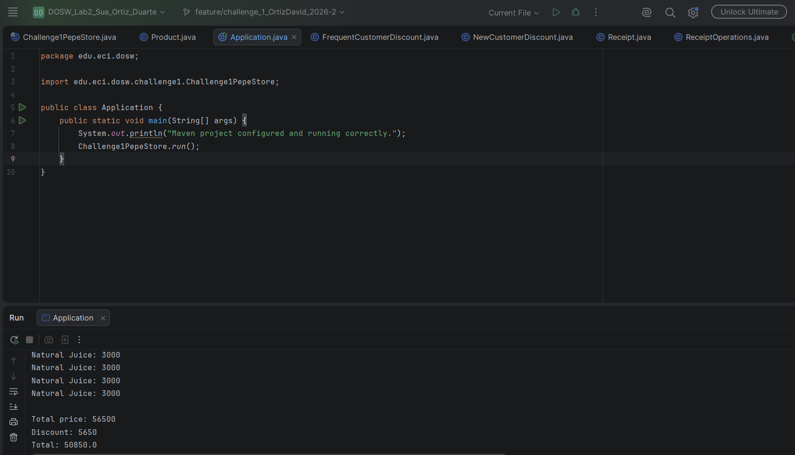

# DOSW - Laboratorio 2

## Integrantes:
* Daniel Felipe Sua Siempira

* Juan Pablo Duarte Silva
  
* David Felipe Ortiz Salcedo

## Reto 1 - Don Pepe's Store

### Evidencia

### Descripción

Para realizar este reto, se clasificó primeramente lo que se necesitaba: 
* Clase que se encargue de solo mostrar la factura del cliente
* Interfaz que maneje los descuentos según el tipo de cliente (`New` y `Frequent`)
* Clase que realizara todas las operaciones necesarias para hacer el descuento
* Clase para los productos

Esta lógica se pensó para que se pudieran acceder a los métodos de las clases que tuvieran su propia responsabilidad para que no se modificaran de forma directa (encapsulamiento) y se aplicara polimorfismo en las interfaces de los descuentos. Así mismo, se usaron streams para ejecutar los calculos necesarios en los descuentos de acuerdo a cada tipo de cliente y obtener el precio total original a pagar usando `sum`, sumando la secuencia de elementos (en este caso cada precio de cada producto)  y `mapToInt` para convertir los precios en un entero obteniendo el precio de cada producto.

*Uso de IA*

El uso de Inteligencia Artificial se usó principalmente para comprender el cómo se puede saber qué principios SOLID, polimorfismo, encapsulación e inmutabilidad se pueden usar en un ejercicio en forma de párrafo. Este fue el prompt usado:

"Quiero que tu rol sea como un estudiante de Desarrollo y Operaciones de Software donde tú objetivo es que puedas explicarme cómo puedo identificar principios SOLID, polimorfismo, encapsulación e inmutabilidad se garantiza en un ejercicio. Dame un ejemplo en Java para poder entender. La idea no es que sea un ejemplo de código sino que sea un caso que te dan y que debes resolver teniendo en cuenta lo anterior mencionado."

### Principios SOLID usados

| Principio | Aplicación
| :---: | :---: |
| **S**ingle Responsability | Se usó para que cada clase e interfaz realizara su propio comportamiento: una hace el formato de la factura, otra los descuentos según el tipo de cliente y otra para realizar los cálculos |
| **O**pen/Closed | Usado en la interfaz para descuentos según el tipo de cliente |
| **L**iskov Subsitution | No usado en este reto |
| **I**nterface Segregation | No usado para este reto, ya que solo se uso una interfaz |
| **D**ependency Inversion | La clase ReceiptOperations dependió de las interfaces para poder calcular los descuentos |

### Polimorfismo

Se usó polimorfismo en las interfaz que da el contrato de dar descuento según el tipo de cliente (NewCustomerDiscount y FrequentCustomerDiscount).

### Encapsulación e Inmutabilidad

La encapsulación se utilizó en las clases Product y Receipt. Principalmente para que los atributos de Product solo se pudieran leer por las demás clases que la fueran a utilizar pero no de forma directa.

Por otro lado, la inumutabilidad también se usaron en estos atributos para que no se pudiera modificar el precio total ni la cantidad final a pagar por el cliente.

## Reto 2 - The Five-Star Chef

### Evidencia

### Descripción

### Patrones de Diseño usados

| Item | Explicación
| :---: | :---: |
| Categoría del Patrón de Diseño | Explicación... |
| Patrón usado | Explicación... |
| Justificación | Explicación... |
| Cómo fue aplicado | Explicación... |

## Reto 3 - The Kingdom of Vehicles

### Evidencia

### Descripción

### Patrones de Diseño usados

| Item | Explicación
| :---: | :---: |
| Categoría del Patrón de Diseño | Explicación... |
| Patrón usado | Explicación... |
| Justificación | Explicación... |
| Cómo fue aplicado | Explicación... |

## Reto 4 - The Currency Exchange Sam

### Evidencia

### Descripción

### Patrones de Diseño usados

| Item | Explicación
| :---: | :---: |
| Categoría del Patrón de Diseño | Explicación... |
| Patrón usado | Explicación... |
| Justificación | Explicación... |
| Cómo fue aplicado | Explicación... |

## Reto 5 - Customized Coffee

### Evidencia

### Descripción

### Patrones de Diseño usados

| Item | Explicación
| :---: | :---: |
| Categoría del Patrón de Diseño | Explicación... |
| Patrón usado | Explicación... |
| Justificación | Explicación... |
| Cómo fue aplicado | Explicación... |

## Reto 6 - Talk to Technical Support

### Evidencia

### Descripción

### Patrones de Diseño usados

| Item | Explicación
| :---: | :---: |
| Categoría del Patrón de Diseño | Explicación... |
| Patrón usado | Explicación... |
| Justificación | Explicación... |
| Cómo fue aplicado | Explicación... |

## Reto 7 - The Magic Remote Control

### Evidencia

### Descripción

### Patrones de Diseño usados

| Item | Explicación
| :---: | :---: |
| Categoría del Patrón de Diseño | Explicación... |
| Patrón usado | Explicación... |
| Justificación | Explicación... |
| Cómo fue aplicado | Explicación... |

## Reto 8 - The UML Zoo

### Evidencia

### Descripción

## Clases Principales y sus Responsabilidades

| Clase o Interfaz | Responsabilidad
| :---: | :---: |
| Clase... | Explicación... |

### Principios SOLID usados

| Principio | Aplicación
| :---: | :---: |
| **S**ingle Responsability | Explicación... |
| **O**pen/Closed | Explicación... |
| **L**iskov Subsitution | Explicación... |
| **I**nterface Segregation | Explicación... |
| **D**ependency Inversion | Explicación... |

### Patrones de Diseño usados

| Item | Explicación
| :---: | :---: |
| Categoría del Patrón de Diseño | Explicación... |
| Patrón usado | Explicación... |
| Justificación | Explicación... |
| Cómo fue aplicado | Explicación... |