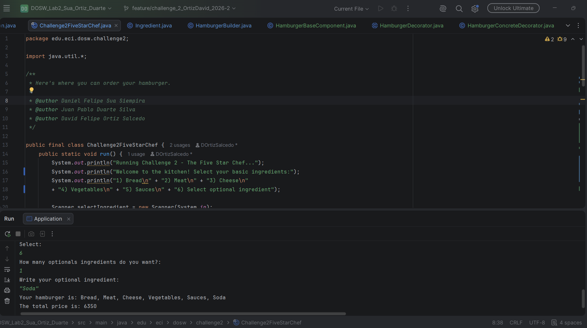
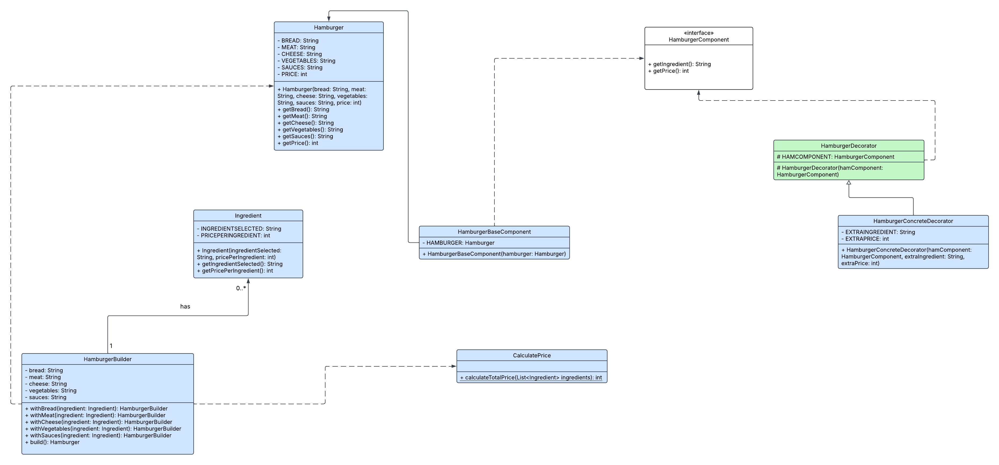
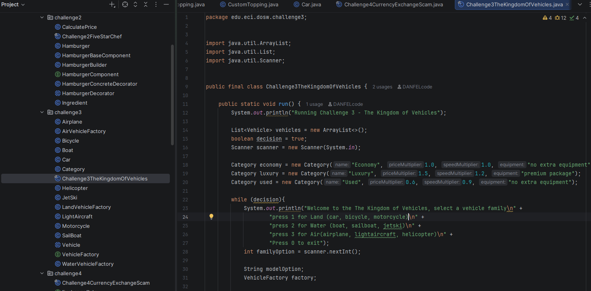
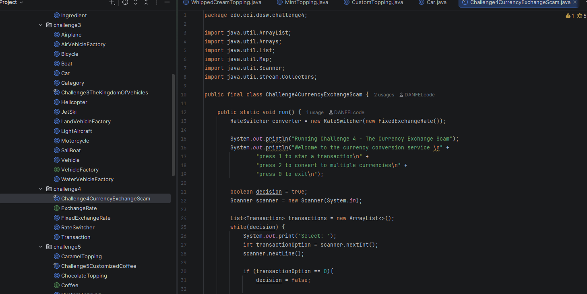
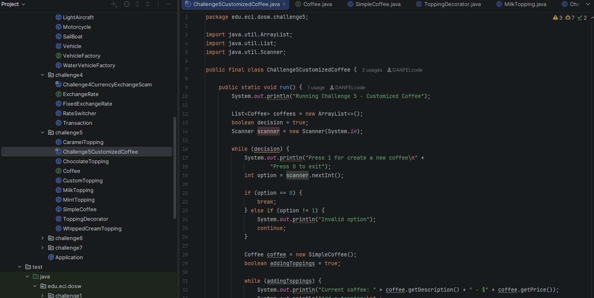
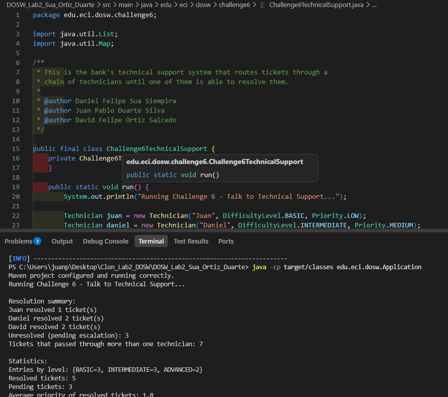
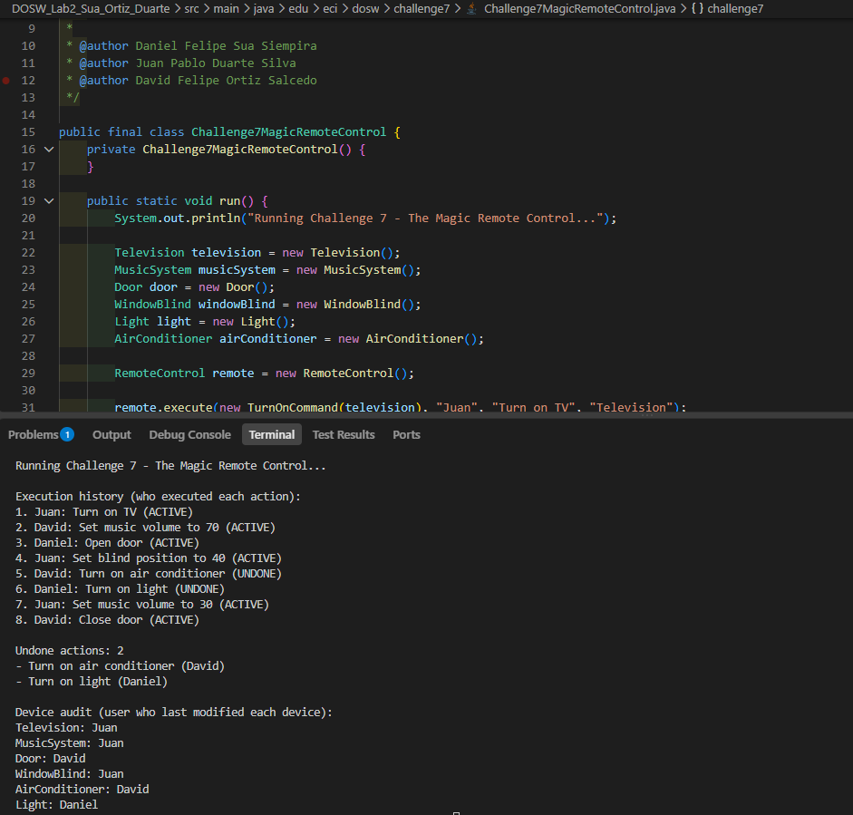
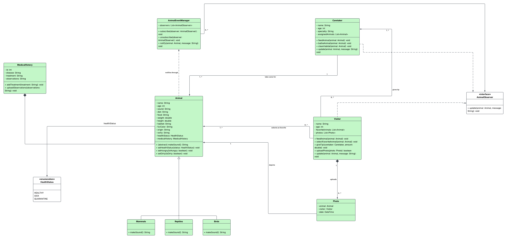

# DOSW - Laboratorio 2

## Integrantes:
* Daniel Felipe Sua Siempira

* Juan Pablo Duarte Silva
  
* David Felipe Ortiz Salcedo

## Reto 1 - Don Pepe's Store

### Evidencia

### Descripción

Para realizar este reto, se clasificó primeramente lo que se necesitaba: 
* Clase que se encargue de solo mostrar la factura del cliente
* Interfaz que maneje los descuentos según el tipo de cliente (`New` y `Frequent`)
* Clase que realizara todas las operaciones necesarias para hacer el descuento
* Clase para los productos

Esta lógica se pensó para que se pudieran acceder a los métodos de las clases que tuvieran su propia responsabilidad para que no se modificaran de forma directa (encapsulamiento) y se aplicara polimorfismo en las interfaces de los descuentos. Así mismo, se usaron streams para ejecutar los calculos necesarios en los descuentos de acuerdo a cada tipo de cliente y obtener el precio total original a pagar usando `sum`, sumando la secuencia de elementos (en este caso cada precio de cada producto)  y `mapToInt` para convertir los precios en un entero obteniendo el precio de cada producto.

*Uso de IA*

El uso de Inteligencia Artificial se usó principalmente para comprender el cómo se puede saber qué principios SOLID, polimorfismo, encapsulación e inmutabilidad se pueden usar en un ejercicio en forma de párrafo. Este fue el prompt usado:

"Quiero que tu rol sea como un estudiante de Desarrollo y Operaciones de Software donde tú objetivo es que puedas explicarme cómo puedo identificar principios SOLID, polimorfismo, encapsulación e inmutabilidad se garantiza en un ejercicio. Dame un ejemplo en Java para poder entender. La idea no es que sea un ejemplo de código sino que sea un caso que te dan y que debes resolver teniendo en cuenta lo anterior mencionado."

### Principios SOLID usados

| Principio | Aplicación
| :---: | :---: |
| **S**ingle Responsability | Se usó para que cada clase e interfaz realizara su propio comportamiento: una hace el formato de la factura, otra los descuentos según el tipo de cliente y otra para realizar los cálculos |
| **O**pen/Closed | Usado en la interfaz para descuentos según el tipo de cliente |
| **L**iskov Subsitution | No usado en este reto |
| **I**nterface Segregation | No usado para este reto, ya que solo se uso una interfaz |
| **D**ependency Inversion | La clase ReceiptOperations dependió de las interfaces para poder calcular los descuentos |

### Polimorfismo

Se usó polimorfismo en las interfaz que da el contrato de dar descuento según el tipo de cliente (NewCustomerDiscount y FrequentCustomerDiscount).

### Encapsulación e Inmutabilidad

La encapsulación se utilizó en las clases Product y Receipt. Principalmente para que los atributos de Product solo se pudieran leer por las demás clases que la fueran a utilizar pero no de forma directa.

Por otro lado, la inumutabilidad también se usaron en estos atributos para que no se pudiera modificar el precio total ni la cantidad final a pagar por el cliente.

### Tests

Tests ejecutados: 6
Fallos: 0
Errores: 0
Saltados: 0

## Reto 2 - The Five-Star Chef

### Evidencia

#### Evidencia en código

#### Diagrama UML

### Descripción

Para realizar este ejercicio, principalmente se usaron los patrón de diseño `Builder` y `Decorator`. El patrón `Builder` se usó con el fin de que a medida que se vaya construyendo la hamburguesa, se hiciera de acuerdo a lo que quisiera el usuario: si era con pan, con carne, con salsas, otros ingredientes y demás. 

Seguidamente, se usó el patrón Decorator para que cuando se obtuviera una hamburguesa base (hamburguesa con los ingredientes básicos, sin extras) entonces la clase `HamburgerBaseComponent` permitiera que la hamburguesa construida con `HamburgerBuilder` se pudiera relacionar con los componentes, la clase `HamburgerDecorator` "envolviera" la hamburguesa *original construida* en una *nueva* hamburguesa que pudiera entenderse con los componentes y finalmente añadir los ingredientes extra junto a los ingredientes que ya tenía anteriormente.

Finalmente, para el calculo de los precios, se usaron streams con los métodos `mapToInt()`, `filter` y `sum()` para pasar la secuencia de elementos a enteros y sumarlos respectivamente; así mismo, para filtrar los elementos a que solo sean positivos.

### Patrones de Diseño usados

| Item | Explicación
| :---: | :---: |
| Categoría del Patrón de Diseño | Creacional |
| Patrón usado | Builder |
| Justificación | Construir la hamburguesa según como el usuario quiera utilizando el mismo método |
| Cómo fue aplicado | Se crearon métodos with'X' donde X eran los distintos ingredientes básicos que tendría la hamburguesa, llamando a los getters de la clase Ingredient y finalmente un método build para instanciar un objeto Hamburger junto a su precio|

| Item | Explicación
| :---: | :---: |
| Categoría del Patrón de Diseño | Estructural |
| Patrón usado | Decorator |
| Justificación | Mantener el estado de la hamburguesa original con "una nueva" hamburguesa que se obtuviera a partir de los nuevos ingredientes que se añadieran |
| Cómo fue aplicado | Se usó una interfaz para que todos los componentes utilizaran el mismo contrato y que cada uno sobreescribiera la forma en que lo iba utilizar (hacer que la misma hamburguesa se pudiera comunicar con los componentes y poder envolverla). Para finalmente, una clase hija pudiera heredar los métodos de su clase padre y añadir los ingredientes adicionales |

### Tests

Tests ejecutados: 5
Fallos: 0
Errores: 0
Saltados: 0

## Reto 3 - The Kingdom of Vehicles

### Evidencia

### Descripción

Para este reto se usó el patrón de diseño `Factory Method`, ya que el enunciado pedía que el sistema pudiera generar distintos tipos de vehiculos (terrestres, acuaticos y aereos) sin que el código que atiende la compra tuviera que conocer los detalles de construcción de cada uno. Se crearon las clases `Vehicle` (clase abstracta con los atributos y comportamiento comunes) y las 9 clases concretas de modelo: `Car`, `Bicycle`, `Motorcycle`, `Boat`, `SailBoat`, `JetSki`, `Airplane`, `LightAircraft` y `Helicopter`, cada una con su propio precio y velocidad base fijos.

La interfaz `VehicleFactory` define el contrato createVehicle(model, category), y cada familia tiene su propia implementación (`LandVehicleFactory`, `WaterVehicleFactory`, `AirVehicleFactory`) que decide, según el modelo pedido, cual clase concreta instanciar. La categoría (Economy, Luxury, Used) se representó como una clase aparte, `Category`, que trae multiplicadores de precio y velocidad, así el mismo modelo puede tener características distintas según la categoría elegida, sin necesitar una subclase por cada combinación.

Ya por último, `Challenge3TheKingdomOfVehicles` usa streams con `mapToDouble()` y `sum()` para calcular el precio total de la compra, y aplica un descuento del 20% cuando se compran dos o más vehículos.

### Patrones de Diseño usados

| Item | Explicación
| :---: | :---: |
| Categoría del Patrón de Diseño | Creacional |
| Patrón usado | Factory Method |
| Justificación | El enunciado pedía generar vehiculos de distintas familias y modelos sin que el sistema supiera de antemano los detalles de construcción de cada tipo específico |
| Cómo fue aplicado | Se creó la interfaz VehicleFactory como contrato, y cada familia (LandVehicleFactory, WaterVehicleFactory, AirVehicleFactory) implementa la creación de sus propios modelos según el texto que ingresa el usuario, delegando en la clase abstracta Vehicle los atributos y comportamiento comunes |

## Reto 4 - The Currency Exchange Sam

### Evidencia

### Descripción

Para este reto se uso el patrón de diseño `Strategy`, ya que el enunciado exigia corregir el error del antiguo dueño de usar la misma tasa para todas las conversiones, y el sistema debia permitir obtener la tasa correcta entre cualquier par de monedas sin que el servicio de conversión supiera de dónde salen esas tasas. Se creó la interfaz `ExchangeRate` con el método getRate(origin, destination), y la clase `FixedExchangeRate` la implementa guardando las tasas de cada moneda respecto a una moneda base (USD), en vez de guardar un valor por cada par posible, asi se evita que el número de tasas crezca exponencialmente si se agregan más monedas.

La clase `RateSwitcher` recibe un ExchangeRate por constructor (inyección de dependencia) y lo usa para calcular la conversión, sin conocer si las tasas vienen de un mapa fijo, un archivo o una API. Cada conversión se representa con la clase inmutable Transaction.

Ya por último, `Challenge4CurrencyExchangeScam` acumula las transacciones en una lista y usa streams con `groupingBy()` y `summingDouble()` para calcular los totales convertidos agrupados por moneda destino.

### Patrones de Diseño usados

| Item | Explicación
| :---: | :---: |
| Categoría del Patrón de Diseño | De comportamiento |
| Patrón usado | Strategy |
| Justificación | El enunciado exigia que la conversión se hiciera con la tasa real de cada par de monedas, sin que el servicio de conversión dependiera de una única forma fija de obtener esas tasas |
| Cómo fue aplicado | Se creó la interfaz ExchangeRate como contrato, y la clase RateSwitcher recibe una implementación por constructor en vez de crearla ella misma, permitiendo cambiar la fuente de las tasas sin modificar el servicio de conversión |

## Reto 5 - Customized Coffee

### Evidencia

### Descripción

Para este reto se uso el patrón de diseño `Decorator`, ya que el enunciado pedia que se pudieran agregar toppings a un café sin modificar la clase base del café, y que fuera posible incorporar nuevos toppings en el futuro sin tocar lo ya construido. Se creó la interfaz Coffee con los métodos getDescription() y getPrice(), la clase SimpleCoffee como el componente base, y la clase abstracta ToppingDecorator que implementa Coffee y envuelve otro objeto Coffee.

Cada topping (`MilkTopping`, `ChocolateTopping`, `CaramelTopping`, `WhippedCreamTopping`, `MintTopping`) extiende `ToppingDecorator` y delega en el café que envuelve para obtener la descripción y el precio previos, sumándole lo propio. También se creó `CustomTopping` para permitir toppings con nombre y precio definidos por el usuario, sin tener que crear una clase nueva por cada uno.

Ya por último, `Challenge5CustomizedCoffee` permite armar varios cafés en una misma ejecución y usa streams con `mapToDouble()` y `sum()` para calcular el precio total de todos los cafés creados.

### Patrones de Diseño usados

| Item | Explicación
| :---: | :---: |
| Categoría del Patrón de Diseño | Estructural |
| Patrón usado | Decorator |
| Justificación | El enunciado pedia agregar toppings a un café en tiempo de ejecución sin modificar la clase base, permitiendo además incorporar nuevos toppings sin tocar el código existente |
| Cómo fue aplicado | Se creó la interfaz Coffee como contrato, la clase SimpleCoffee como componente base, y la clase abstracta ToppingDecorator que envuelve un Coffee y delega en él, permitiendo apilar toppings uno sobre otro (coffee = new MilkTopping(coffee)) sin que ninguna clase conozca a las demás |

## Reto 6 - Talk to Technical Support

### Evidencia

### Descripción

Para este reto se uso el patrón de diseño `Chain of Responsibility`, ya que el enunciado pedia literalmente que un ticket pasara de técnico en técnico hasta encontrar uno capaz de resolverlo. Se crearon las clases `Ticket` y `TicketResolution` (el resultado del procesamiento, con el tecnico que lo resolvió y la lista de técnicos que lo intentaron).

La interfaz `SupportHandler` define el contrato de la cadena handle(`Ticket`), y la clase `Technician` la implementa: cada técnico tiene una especialidad (que debe coincidir exactamente con el nivel del ticket) y una prioridad máxima que puede atender (que funciona como un umbral, es decir, atiende su nivel y los inferiores). Si un técnico no puede resolver el ticket, lo delega al siguiente next usando la misma interfaz, sin conocer los detalles de los demás técnicos.

Ya por último, `SupportChain` arma la cadena y procesa la lista de tickets, y `SupportStatistics` usa streams para calcular cuántos tickets resolvió cada técnico, cuántos quedaron pendientes y la prioridad media de los tickets resueltos.

### Patrones de Diseño usados

| Item | Explicación
| :---: | :---: |
| Categoria del Patron de Diseño | De comportamiento |
| Patron usado | Chain of Responsibility |
| Justificación | El enunciado pedia que un ticket se pasara de técnico en técnico hasta que alguno pudiera resolverlo, sin que el sistema supiera de antemano cual técnico especifico lo atenderia |
| Cómo fue aplicado | Se creó la interfaz SupportHandler como contrato de la cadena, y la clase Technician la implementa: si no puede resolver el ticket (por especialidad o prioridad), delega al siguiente técnico usando la misma interfaz |

## Reto 7 - The Magic Remote Control

### Evidencia

### Descripción

Para este reto se usó el patrón de diseño `Command`, ya que el enunciado pedía que cada acción sobre un dispositivo pudiera tener parámetros y pudiera deshacerse despues de ejecutada, lo cual es la definición del patrón. Se creó la interfaz `Command` y varios comandos como: `TurnOnCommand` y `TurnOffCommand` (estas se reutilizaron para luces, TV y aire acondicionado con la interfaz `Switchable`), `OpenDoorCommand`, `CloseDoorCommand` y unos comandos con parámetros como `SetVolumeCommand` y `SetBlindPositionCommand`. Cada comando guarda su estado anterior antes de ejecutarse para revertirlo exactamente al deshacerlo.

La clase `RemoteControl` es el que ejecuta cada comando y lo registra en un historial `ExecutedAction` junto al usuario que lo hizo. En la parte final, `RemoteControlAudit` usa streams para responder las preguntas de auditoria del enunciado: que acciones se deshicieron y que usuario fue el último en modificar cada dispositivo

### Patrones de Diseño usados

| Item | Explicación
| :---: | :---: |
| Categoria del Patron de Diseño | De comportamiento |
| Patron usado | Command |
| Justificación | El enunciado pedia que cada accion tuviera parámetros y pudiera deshacerse después de ejecutarse, que es la definición central del patrón Command |
| Como fue aplicado | Se creo la interfaz Command con los metodos execute() y undo(), implementada por cada comando, el invocador RemoteControl ejecuta cualquier Command sin conocerlo en detalle, y cada comando guarda el estado anterior del dispositivo para poder revertirlo |

## Reto 8 - The UML Zoo

### Evidencia

## Clases Principales y sus Responsabilidades

| Clase o Interfaz | Responsabilidad
| :---: | :---: |
| Animal | Es una clase padre que se encarga de representar las características de un animal en general |
| Mammals | Es la clase hija que representa al grupo de animales pertenecientes a los mamíferos |
| Reptiles | Es la clase hija que representa al grupo de animales pertenecientes a los reptiles |
| Birds | Es la clase hija que representa al grupo de animales pertenecientes a las aves |
| MedicalHistory | Tiene como responsabilidad mostrar la historia médica de cada animal como su enfermedad o el tratamiento a dar |
| HealthStatus | Es una enumeración que determina las distintas constantes que puede tomar el estado de salud de un animal |
| Caretaker | Representa las características del cuidador de un animal en el zoológico donde lo puede bañar, alimentar o limpiar |
| Visitor | Es el visitante donde su responsabilidad es dar propina al cuidador o tomar una foto de un animal |
| AnimalEventManager | Esta clase se encarga de notificar los estados en el que esté el animal |
| AnimalObserver | La interfaz encargada de actualizar lo que sucede con el estado del animal |

### Relaciones

| Recurso | Relación | Destino | Multiplicidad | Explicación
| :---: | :---: | :---: | :---: | :---: |
| Animal | Herencia | Mammals | Ninguna | Clase hija de la clase padre Animal |
| Animal | Herencia | Reptiles | Ninguna | Clase hija de la clase padre Animal |
| Animal | Herencia | Birds | Ninguna | Clase hija de la clase padre Animal |
| Animal | Uso | AnimalEventManager | Ninguna | Notifica el estado del animal |
| Animal | Atributo | HealthStatus | Ninguna | Los distintos estados de salud que puede tener el animal |
| Animal | Composición | MedicalHistory | Ninguna | Posee la historia médica del animal (si no hay historia médica, no se sabría qué enfermedad tiene el animal y como tratarlo) |
| AnimalEventManager | Atributo | AnimalObserver | Ninguna | Usa la interfaz para usar el contrato (actualizar) sobre el estado del animal |
| Caretaker | Atributo | Animal | 1 - 1..* | Cuida del animal de modo que ve cuál es su estado: enfermedad, hambruna o suciedad |
| Caretaker | Uso | AnimalObserver | Ninguna | Usa la interfaz para ser notificado del estado del animal |
| Visitor | Atributo | Animal | 1..* - 0..* | Tomar la foto del animal |
| Visitor | Atributo | Caretaker | 0..* - 1..* | Dar propina al cuidador |
| Visitor | Composición | Photo | Ninguna | Subir la foto a la cámara |

### Principios SOLID usados

| Principio | Aplicación
| :---: | :---: |
| **S**ingle Responsability | Se aplicó en las clases Animal, MedicalHistory, Caretaker y Visitor con el fin de que cada una se encargue de su propio comportamiento al ser objetos diferentes |
| **O**pen/Closed | Se utilizó en la clase abstracta Animal por si pueden haber más animales (clases hijas) y simplemente sobreescriban los métodos |
| **L**iskov Subsitution | Usado en los tipos de animales dado que cada animal tiene un sonido diferente por lo que no altera el funcionamiento del sistema  |
| **I**nterface Segregation | Solamente se usó una interfaz para aplicar el patrón de diseño Observer con el fin de que simplemente actualice el estado del animal |
| **D**ependency Inversion | Fue usado para que AnimalEventManager usara una lista con aquellos que observaran al animal (caretakers y visitors) a través del uso del contrato update de la interfaz AnimalObserver |

### Patrones de Diseño usados

| Item | Explicación
| :---: | :---: |
| Categoría del Patrón de Diseño | De comportamiento |
| Patrón usado | Observer |
| Justificación | Se utilizó para que cuidadores y visitantes estuvieran al tanto de cuando un animal cambia de estado como lo es hambriento, sucio o enfermo |
| Cómo fue aplicado | El manejador del evento AnimalEventManager no depende de Caretaker o Visitor por lo que usa una lista de observadores para notificar el estado por medio del contrato de la interfaz AnimalObserver |

#### Nota

En realidad no sabiamos si implementar este patrón de diseño en el diagrama debido a que interpretamos que los animales tenían distintos estados entonces optamos por usar el patrón de diseño Observer.

### Miembros del Equipo

| Estudiante | Usuario de GitHub | Contribuciones Principales
| :---: | :---: | :---: |
| Daniel Felipe Sua Siempira | DANFELcode | Realizó los retos 3, 4 y 5 |
| Juan Pablo Duarte Silva | JuanP-4bl0 | Realizó los retos 6, 7 y parte del 8 |
| David Felipe Ortiz Salcedo | DOrtizSalcedo | Realizó los retos 1, 2 y parte del reto 8 |